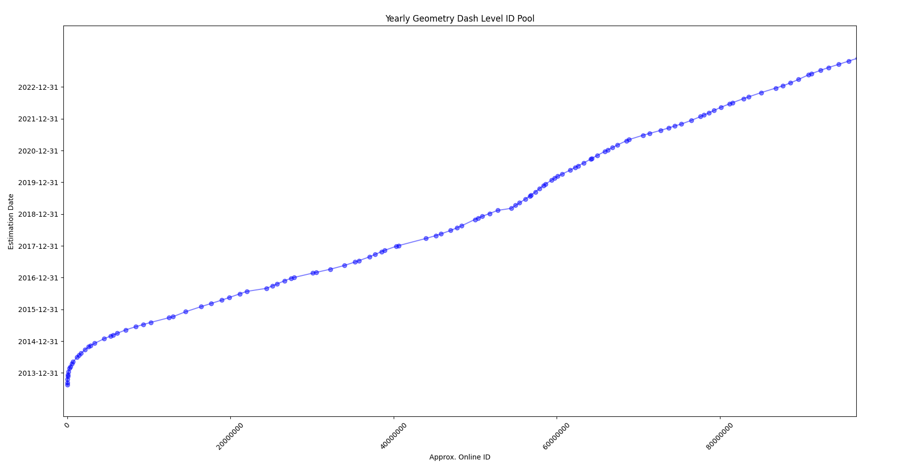

# Geometry Dash ID History Graphing Utility
Upon researching for a video I created a tool that allows you to graph level IDs from the game Geometry Dash on a monthly, weekly or yearly basis. It fetches approximate ID values attached to a certain date from the GDHistory API site.

This tool uses **matplotlib** for the graph view and also supports an organized CSV export table for those who wish to export data.

**API:** https://history.geometrydash.eu/

**Interaction:** https://history.geometrydash.eu/api/v1/date/date/{random_date}



### Configuration
```
start_date = datetime(2013, 7, 1)
end_date = datetime.now()
date_list = [generate_random_date(date.year, date.month) for date in pd.date_range(start=start_date, end=end_date, freq='MS')]
```

### Setup
1) Clone this repository
2) Run `pip install -r requirements.txt`
3) Run either the main `run.py` file for a graph view or `spreadsheet.py` for a quick CSV export
4) Tweak the configuration as needed for use case
